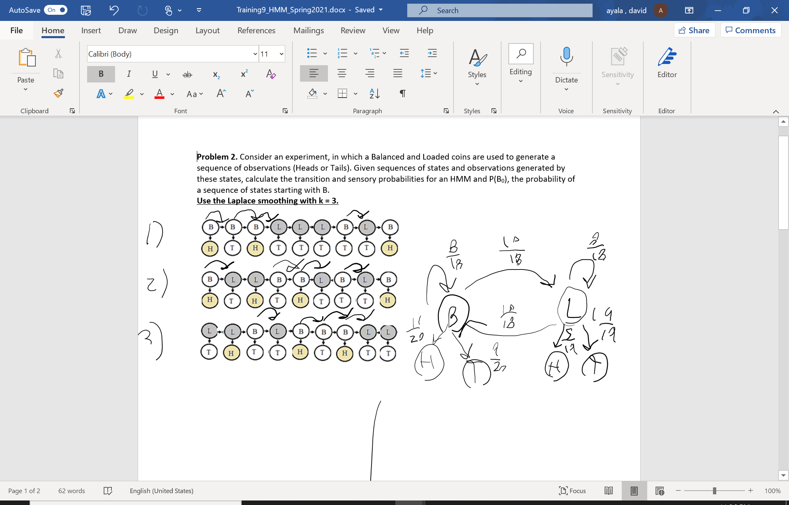
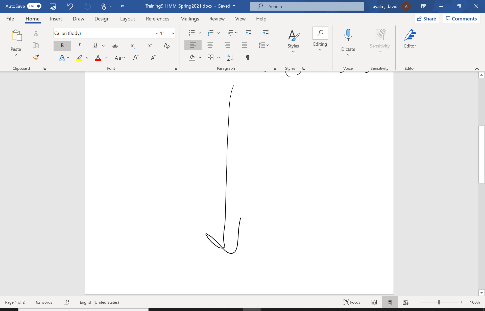

# Complaints for Microsoft Word on Surface

## David Ayala 03/04/2021

I have been using computers since I was in first grade. I am able to pick up new technologies quickly and understand 
them based on me seeing the same patterns over and over. 

I got a Microsoft Surface 2 Go recently along with a touch pen. This is **useful** because I do not have to purchase 
more notebooks, printer paper and printer ink. I got Microsoft Word on my Surface, and I desire to be able to use it
by simply opening PDFs and editing them to finish school assignments. This will make me get my homework done **effectively**,
and it could save me money from buying tons of notebooks. My notes can also be stored on the cloud to prevent them from
being lost as well.

To begin working on an assignment, I downloaded an assignment PDF that my machine learning instructor gave me.
This usually works just fine and I am able to open the file in Microsoft Word and begin drawing on it using
the pen. This usually works great and I am **satisfied** with the ability to move the text down to make room for more
drawings. Microsoft Word is quickly **learnable**. 

The problem occurs when I write to the end of the document and I need to add a page to draw more. I can't use the Insert 
Page because it will insert whereever the text insert icon is, which near the top of the page. I can't move the text insert 
after I already drew on the page because it will move all the drawings down as well, which will make it hard to tell what
I was trying to accomplish. This fails to be **error-tolerant**. 

As a result, I have to draw this ugly arrow to instruct to the grader that my work continues on the next page, and I have
to move all the writing down. This is also not **safe** as if the grader does not know what I intend, I could lose grade
points and lower my overall homework grade.

I believe this should be addressed by allowing the text editor cursor to be moved around freely using the touch pen without
bringing up the keyboard and having to press the enter key over and over. If this feature would be added, this would not
be an issue for those who don't have money for the additional keyboard.
