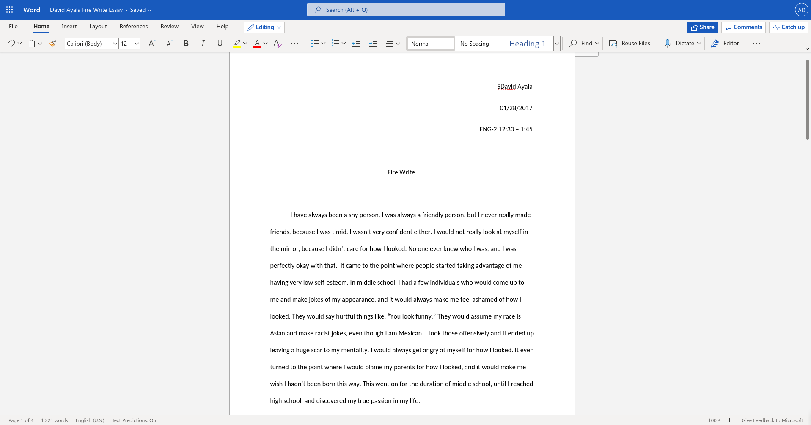
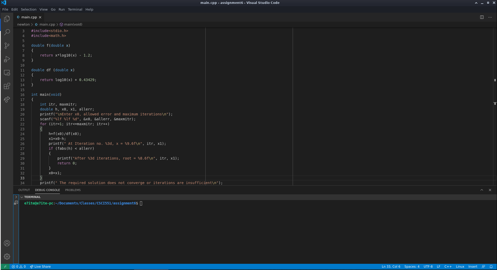

# Appeciation for Visual Studio Code

## David Ayala 05/02/2021

I am a computer science student, and I have been using computers for since I was in the first grade. Computer science students learn about theories on how to make computers do helpful tasks in our daily life as fast and robust as possible. Many decades of technology advancement has gotten them this far, which is why we are able to use them as much as we do. I want to help in this advancement, which is why I am studying it. Programming is the ability to speak the same language as the computer to tell it to do what you want. It is an important skill to have as a computer science student. I first started programming in my community college, but my experiences as a young one have helped me learn how to do it quickly.

Programming is done similarly to the way one would type an essay on a computer. There are tools that help us write and format our essays, such as Microsoft Word, or Google Docs. The same way there are tools for writing essays, there are tools for programming. These are usually called IDEs (Integrated Development Environment). They provides us with help remebering certain words that the computer understands, which is similar to how something like Microsoft Word helps us format our essays in a particular format for our English class.

My current favorite IDE is called Visual Studio Code, which helps me program for school assignments and fun side projects. It is **satisfying** since it makes special words for the computer different, pretty colors so it's easy to tell what is doing what. There are special characters that tell the computer when something starts and ends. They can be highlighted by clicking the start or end character, then you can seem where the pair starts and ends. If you misspell a special word, it will put a red squiggle underneath it. These aids that the IDE provides are quickly **memorable** since they are few of them, and the colors make them easily distinguishable from each other. It is easy to make errors while programming, but this IDE helps those mistakes easy to catch. It makes having to remember certain programming words and special characters trivial. It is **effective** since it helps me get past the setup part quickly to start the actual task at hand. It is quickly **learnable** since it only takes about two steps to start programming: open a folder where my project should be stored, create a file for my work, and I am ready to go! There are many different languages one could program in, and Visual Studio Code supports many of them! 

The only complaint I have is Visual Studio Code is not **error-tolerant**, since sometimes the syntax coloring does not apply, and it does not explain why. You have to spend hours searching on the internet what the possible issue is, and the fixes require many steps that the end-user shouldn't have to deal with. Sometimes it won't fix until you completely redownload the whole IDE again. Fixing this is also not **safe** since, while attempting to fix it, the user may accidently delete all their custom settings for the IDE. Once they are deleted, you have to set them back up again.
