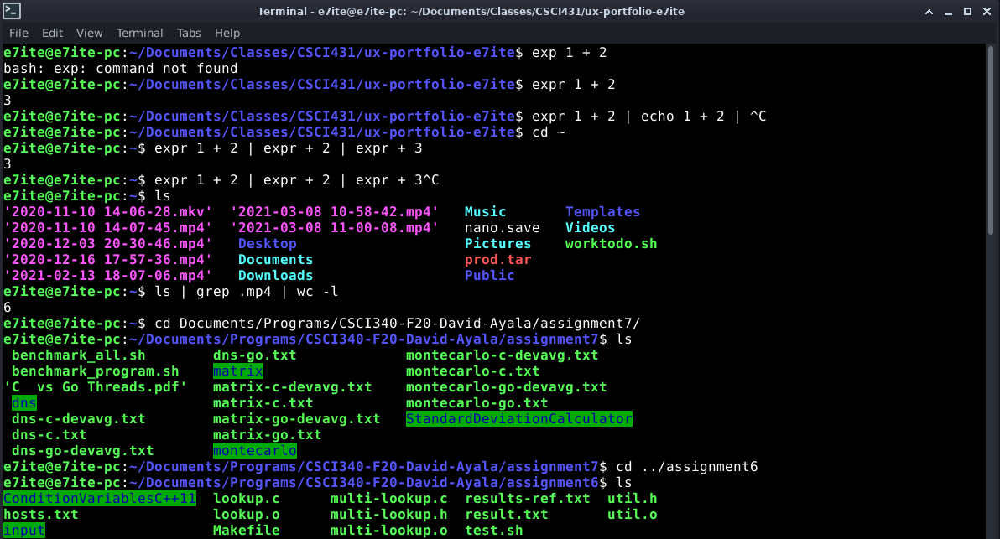

# Appeciation for Bash

## David Ayala 05/17/2021

I want to be able to make computers help serve the public in the most effective ways as possible. I need to use all the work that people have already done so I also have an easier time to do so. The work that I want to help provide benefit in is in software, What is software? We all know that computers are physical, but one thing a lot of us overlook is the fact that a lot of work also goes into something called software. We all have heard that computers work using 0s and 1s only. That is true, but making those 0s and 1s do something like a program that can help you write essays is an intricate process. This is what software does. A lot of theories and research is done to find the best way to use as little 1s and 0s as possible.

There are many layers of software required to just to get to this essay typer such as Microsoft Word. The lowest level one is called the operating system. What actually processes these 1s and 0s is the hardware, or the physical component to our computers. This is what is underneath the case of the computer. The operating system manages all the hardware for it to properly be able to run all those programs that we run in the background, such as our essay writer, music player, video player, etc. Again, decades of work have gone just to this section alone as well. Operating systems include Windows by Microsoft, Mac by Apple, and GNU/Linux by the Free Software Foundation. Most of us are probably using Windows or Mac. The operating system I use is GNU/Linux, since, in my opinion, it is the simplest one to learn how to write software in.

The next layer of software is the programs that run on our operating system. This now includes our essay editor and music players. This is the layer I am working on at the moment. So as I mentioned, I am using work that other people already did to be able to write software. Some of the work I am using includes a program called Bash. The ideology of GNU/Linux is that we should be using a bunch of other little programs to make one big result. So for example, say I want to add two numbers, pass the result to a printer, and have it print the result. Each little step of that involves a bunch of different little programs. One program will do the addition, another will send it to the printer, and one last one will make the printer print the result. A mechanism is needed to be able to run all these little programs and have them communicate with each other. Bash is what does this.

Bash is one one of my favorite programs to use on GNU/Linux. It is basically a small window that you can type in programs to run. You only have to use your mouse to click the window (sometimes not even that). You can chain programs together using certain reserved letters on your keyboard. This allows you to pass the result of one program to another. It is **effective** because it helps me achieve tedious tasks at once using the results of many other programs that exist on my operating system. It is **useful** because finding programs to use is tedious, and Bash has an autocomplete ability that helps this as well. It will you guess the name of a program, and it has the abiltiy to list all the programs you have the have the same starting characters. It is **efficient** because you no longer have to launch many programs and have to click around to get things done. It is **satisfying** because once you see the speed you can achieve with it, you hardly ever want to go back to using a program you have to click with your mouse.

Bash isn't perfect however. It is not **error-tolerant** since if you type something in wrong, the errors are very unclear on how to fix. It is not **safe**, because you can delete files with one command, and it is almost impossible to recover them if you did so by mistake. It is also not easily **learnable** because there are so many things you can do with it, and the documentation is not online. I would recommend this program can be more error-tolerant by having more clear descriptions about an error. It can also be more safe by always requiring a confirmation when deleting, or by providing a mechanism where when files are deleted, they are moved to a temporary storage for a few days. You should be able to recover the file from this temporary storage. If a few days go by and the file is not recovered, then it should be deleted all the way.

In this error here, I needed to type a space and a number to get this to work. The error does not make that obvious at all.

